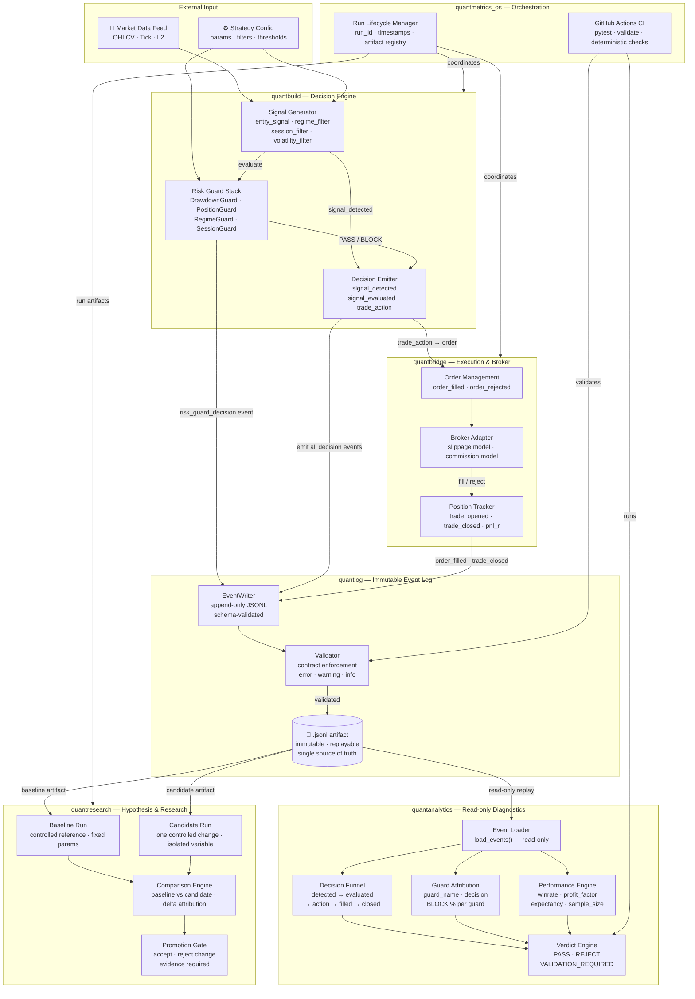

# QuantMetrics Suite

[](https://github.com/roelofgootjesgit/QuantMetrics-Suite/actions/workflows/ci.yml)

> We don't claim edge — we build the system that proves it.

Modular Python infrastructure for evaluating trading strategy decisions under controlled, reproducible conditions. Every decision event is logged, every run is comparable, every promotion requires evidence.

---

## Architecture



> **Decision flow:** market data → signal → risk guards → decision events → immutable log → analytics → PASS / REJECT verdict
> **Research flow:** log artifact → baseline run vs candidate run → comparison → promotion gate
> **Invariants:** `quantlog` is append-only and schema-validated. `quantanalytics` is read-only. Every guard decision is a logged event regardless of outcome.

---

## Modules

| Module | Responsibility |
|---|---|
| `quantbuild` | Decision engine. Generates signals, applies the risk guard stack, emits typed decision events. No execution concern. |
| `quantbridge` | Execution layer. Translates `trade_action` events into orders, models slippage and commission, tracks positions and `pnl_r`. |
| `quantlog` | Immutable, schema-validated JSONL event log. Single source of truth. All modules write through it; analytics is read-only. |
| `quantanalytics` | Read-only diagnostics. Replays events to compute funnel conversion rates, guard attribution, and a deterministic PASS / REJECT verdict. |
| `quantresearch` | Hypothesis layer. Enforces baseline-vs-candidate comparison with one controlled variable change per run. No blind optimisation. |
| `quantmetrics_os` | Orchestration. Coordinates module execution, manages `run_id` and artifact registry, integrates with CI. |

---

## Design decisions

**Separation of decision and execution.** `quantbuild` never touches an order. `quantbridge` never generates a signal. The boundary is enforced structurally, not by convention.

**Immutable log as source of truth.** Every event — including `risk_guard_decision` BLOCK events — is written to an append-only JSONL file before any analytics runs. There is no in-memory state that isn't recoverable from the log.

**Read-only analytics.** `quantanalytics` has no write path. Deterministic output from a fixed input file means results can be verified by anyone, any time.

**Controlled iteration.** `quantresearch` does not expose a parameter sweep interface. A candidate run changes exactly one thing relative to the baseline. The promotion gate rejects anything that doesn't meet the evidence threshold.

---

## Questions the system answers

- Where in the decision funnel was opportunity lost — signal, guard, execution, or fill?
- Which risk guard is responsible for the majority of blocks?
- Did performance improve because the signal improved, or because filtering was relaxed?
- Is the sample large enough and the expectancy positive enough to promote this change?

---

## Quick start

```bash
pip install -r requirements.txt
python run_demo.py
```

Runs a deterministic analysis on a sample `.jsonl` event file. Output includes event counts by type, funnel conversion rates, guard attribution, trade performance metrics, and a final verdict. No live data, no external dependencies.

Expected output structure:

```
Total events: N
Event counts by type: ...
Funnel: detected → evaluated → action → filled → closed
Conversion rates: ...
Guard attribution: ...
Top blocking guard: <guard_name> (N% of blocks)
Trade performance: winrate / profit_factor / expectancy / sample_size
Validation errors: 0
Verdict: PASS
```

---

## Testing

Two levels of test coverage with a clear separation of purpose.

**Root suite — cross-module boundaries and deterministic demo behavior:**

```bash
pytest tests -q          # smoke suite, run often
pytest --collect-only -q # verify what's collected
```

**Module suites — deeper validation per layer:**

```bash
pytest quantbuild/tests -q
pytest quantanalytics/tests -q
pytest quantlog/tests -q
pytest quantresearch/tests -q
```

CI runs `pytest tests -q` and `python run_demo.py` automatically on every push and pull request. The demo output is treated as a regression check — if the verdict changes on a fixed input file, the build fails.

Practical workflow: run the root suite while iterating, run the relevant module suite before opening a PR, let CI validate the baseline on every push.

---

## Evaluation workflow

```
1. Run baseline              — fixed parameters, controlled conditions
2. Run candidate             — one change, everything else identical
3. Compare with analytics    — funnel diff, guard attribution delta, performance delta
4. Apply promotion criteria  — minimum sample size, positive expectancy, no validation errors
5. Accept or reject          — evidence required, no exceptions
```

---

## License

MIT. Infrastructure and evaluation design only — no proprietary research configurations, datasets, or production deployment setups are included.
