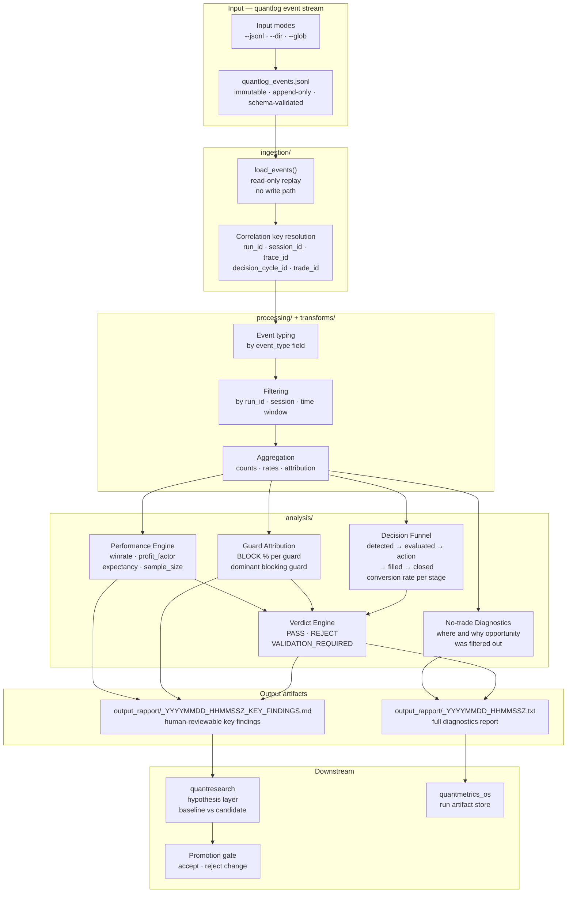

# quantanalytics

Read-only diagnostics layer for the QuantMetrics Suite. Turns `quantlog` event streams into deterministic evidence for strategy evaluation decisions. No write path to source logs, no order placement.

---

## Role in the suite

```
quantbuild / quantbridge  →  quantlog  →  quantanalytics  →  quantresearch / promotion gates
```

`quantbuild` and `quantbridge` produce decision and execution events. `quantlog` stores them as immutable JSONL. `quantanalytics` answers what happened, where opportunity was lost, and whether observed results are stable enough to justify promotion.

---

## Architecture



---

## Outputs

| Artifact | Content |
|---|---|
| Decision funnel | `detected → evaluated → action → filled → closed` with conversion rate per stage |
| Guard attribution | BLOCK % per guard, dominant blocking guard identification |
| No-trade diagnostics | Where and why opportunity was filtered out |
| Performance summary | `winrate`, `profit_factor`, `expectancy`, `sample_size` |
| Key findings `.md` | Human-reviewable artifact per run, consumed by `quantresearch` |

---

## Correlation contract

`quantanalytics` relies on correlation keys emitted upstream. Without them, diagnostics run but decision attribution quality drops.

| Key | Purpose |
|---|---|
| `run_id` | Identifies one run artifact set |
| `session_id` | Groups related runtime sessions inside a run |
| `trace_id` | Links end-to-end execution traces |
| `decision_cycle_id` | Links decision-chain events (`signal_detected` → `trade_action`) |
| `trade_id` / `order_ref` | Links execution and lifecycle events |

---

## Repository layout

```
quantanalytics/
├── quantmetrics_analytics/
│   ├── ingestion/
│   ├── processing/
│   ├── transforms/
│   ├── analysis/
│   └── cli/
├── docs/
├── tests/
├── pyproject.toml
└── README.md
```

- Package: `quantmetrics-analytics`
- Import: `quantmetrics_analytics`
- CLI: `quantmetrics-analytics` or `python -m quantmetrics_analytics.cli.run_analysis`

---

## Quick start

```bash
cd quantanalytics
pip install -e .
```

Run on a single file:

```bash
python -m quantmetrics_analytics.cli.run_analysis \
  --jsonl /path/to/events.jsonl \
  --reports all
```

Run on a directory:

```bash
python -m quantmetrics_analytics.cli.run_analysis \
  --dir /path/to/quantlog_day_folder \
  --reports summary,no-trade,funnel
```

Use exactly one input mode: `--jsonl`, `--dir`, or `--glob`.

Default output location:

```
quantanalytics/output_rapport/<input_stem>_YYYYMMDD_HHMMSSZ.txt
quantanalytics/output_rapport/<input_stem>_YYYYMMDD_HHMMSSZ_KEY_FINDINGS.md
```

---

## Testing

```bash
pytest quantanalytics/tests -q
```

Run as part of the root suite before opening a PR. CI validates the full cross-module baseline on every push.

---

## Documentation

- [`docs/ANALYTICS_ARCHITECTURE.md`](docs/ANALYTICS_ARCHITECTURE.md)
- [`docs/ANALYTICS_SPRINT_PLAN.md`](docs/ANALYTICS_SPRINT_PLAN.md)
- [`docs/LIVE_VPS_AND_LOCAL_BACKTEST.md`](docs/LIVE_VPS_AND_LOCAL_BACKTEST.md)

---

## Suite repositories

| Module | Repository |
|---|---|
| `quantbuild` | [roelofgootjesgit/QuantBuild-Signal-Engine](https://github.com/roelofgootjesgit/QuantBuild-Signal-Engine) |
| `quantbridge` | canonical module: `quantbridge` |
| `quantlog` | canonical module: `quantlog` |
| `quantanalytics` (**this**) | canonical module: `quantanalytics` |
| `quantresearch` | canonical module: `quantresearch` |
| `quantmetrics_os` | [roelofgootjesgit/quantmetrics_os](https://github.com/roelofgootjesgit/quantmetrics_os) |
