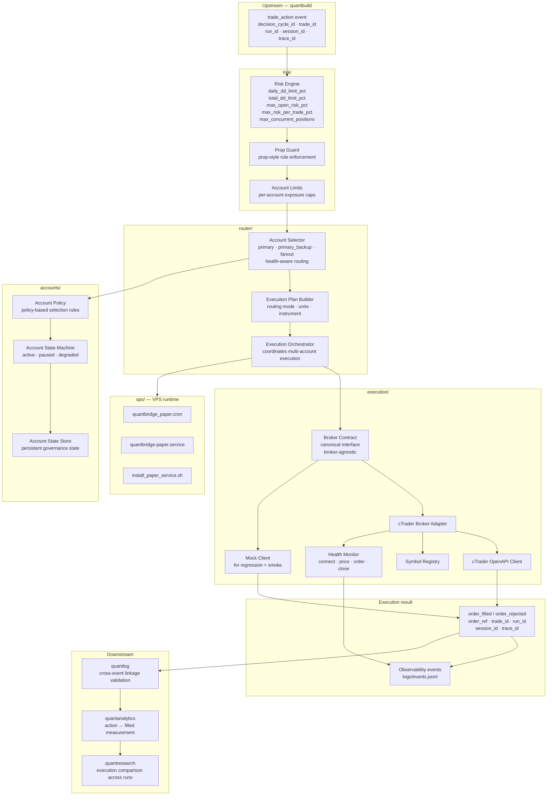

# quantbridge

Execution engine for the QuantMetrics Suite. Handles broker execution, routing, and runtime safeguards while keeping strategy logic out of the broker layer. Broker differences stay in the adapter and transport layers — strategy code contains no broker API calls.

Design boundary: `quantbuild` decides. `quantbridge` executes.

---

## Role in the suite

```
quantbuild  →  quantbridge  →  quantlog  →  quantanalytics  →  quantresearch
                    ↓
              broker API (cTrader / mock)
```

`quantbridge` consumes `decision_cycle_id` and `trade_id` from upstream and emits execution events with `order_ref`, `trade_id`, `run_id`, `session_id`, and `trace_id`. This enables `quantlog` to validate cross-event linkage, `quantanalytics` to measure `action → filled` outcomes, and `quantresearch` to compare execution results across runs.

---

## Architecture



---

## Repository layout

```
src/quantbridge/
├── execution/
│   ├── broker_contract.py       canonical broker interface
│   ├── brokers/ctrader_broker.py
│   ├── clients/
│   │   ├── ctrader_mock_client.py
│   │   └── ctrader_openapi_client.py
│   ├── health.py
│   ├── models.py
│   ├── symbol_registry.py
│   └── errors.py
├── risk/
│   ├── risk_engine.py
│   ├── prop_guard.py
│   └── account_limits.py
├── accounts/
│   ├── account_policy.py
│   ├── account_state_machine.py
│   └── account_state_store.py
└── router/
    ├── account_selector.py
    ├── execution_plan_builder.py
    └── execution_orchestrator.py
configs/
├── ctrader_icmarkets_demo.yaml
├── accounts_baseline.yaml
└── suite_profiles.yaml
ops/vps/
├── quantbridge_paper.cron
├── quantbridge-paper.service
└── install_paper_service.sh
scripts/                         13 operational scripts (see below)
```

---

## Scripts reference

| Script | Purpose |
|---|---|
| `ctrader_smoke.py` | Connect, price, place, close — smoke test in mock or OpenAPI mode |
| `recover_execution_state.py` | Startup reconnect and state recovery before launching bots |
| `run_runtime_control.py` | Continuous sync + failsafe control loop |
| `run_order_lifecycle_check.py` | Submit → confirm fill → protection check |
| `run_account_orchestration_check.py` | Account selection with health/persistence simulation |
| `run_multi_account_execution_check.py` | Multi-account routing modes: single, primary_backup, fanout |
| `run_vps_paper_cycle.py` | VPS startup gate + suite + runtime probe |
| `run_regression_suite.py` | Full mock regression across all core layers |
| `validate_account_env.py` | Account policy to ENV linking validation |
| `account_control.py` | Account governance: status, pause, resume |
| `rotate_observability_events.py` | Log rotation to archive |
| `summarize_observability.py` | Observability summary with time window filter |
| `recover_execution_state.py` | State recovery on restart |

---

## Quick start

```bash
python -m venv .venv
.venv\Scripts\activate
pip install -r requirements.txt
cp .env.example .env        # secrets stay in local.env at runtime
```

Smoke test (mock):

```bash
python scripts/ctrader_smoke.py --config configs/ctrader_icmarkets_demo.yaml
```

Smoke test (OpenAPI):

```bash
python scripts/ctrader_smoke.py --config configs/ctrader_icmarkets_demo.yaml --mode openapi
```

Expected smoke output:

```json
{ "connect": true, "price": true, "place_order": true, "close_order": true }
```

Full mock regression suite:

```bash
python scripts/run_regression_suite.py
```

---

## Routing modes

| Mode | Behaviour |
|---|---|
| `single` | One account, direct execution |
| `primary_backup` | Primary account with automatic failover |
| `fanout` | Parallel execution across N accounts |

Account selector is health-aware — paused or degraded accounts are excluded from routing automatically.

---

## Risk gate flags

Applied per execution, recommended for prop-style checks:

| Flag | Purpose |
|---|---|
| `--daily-dd-limit-pct` | Max daily drawdown % before blocking |
| `--total-dd-limit-pct` | Max total drawdown % before blocking |
| `--max-open-risk-pct` | Max total open risk % at any time |
| `--max-risk-per-trade-pct` | Max risk % per individual trade |
| `--max-concurrent-positions` | Max number of open positions |

---

## Milestones

| Milestone | Status |
|---|---|
| A — Mock abstraction | Done |
| B — Real cTrader demo execution | Done |
| C — Reconciliation + restart safety | Done |
| D — Runtime control + lifecycle safety | Done |
| E — Account orchestration baseline | Done |
| F — Persistent governance + health-aware routing | Done |
| G — Multi-account routing + execution planning | Done |
| H — Multi-account scaling + production observability | In progress |

---

## Engineering rules

- Strategy code contains no broker API calls
- Broker differences stay in adapter and transport layers
- Broker responses are normalized into internal models before any downstream use
- Health and error codes are first-class data, not exceptions

---

## Documentation

- [`docs/ROADMAP.md`](docs/ROADMAP.md)
- [`docs/PAPER_ROLLOUT.md`](docs/PAPER_ROLLOUT.md)
- [`docs/AUTH_SETUP.md`](docs/AUTH_SETUP.md)

---

## Suite repositories

| Module | Repository |
|---|---|
| `quantmetrics_os` | [roelofgootjesgit/quantmetrics_os](https://github.com/roelofgootjesgit/quantmetrics_os) |
| `quantbuild` | [roelofgootjesgit/QuantBuild-Signal-Engine](https://github.com/roelofgootjesgit/QuantBuild-Signal-Engine) |
| `quantbridge` (**this**) | canonical module: `quantbridge` |
| `quantlog` | canonical module: `quantlog` |
| `quantanalytics` | canonical module: `quantanalytics` |
| `quantresearch` | canonical module: `quantresearch` |
