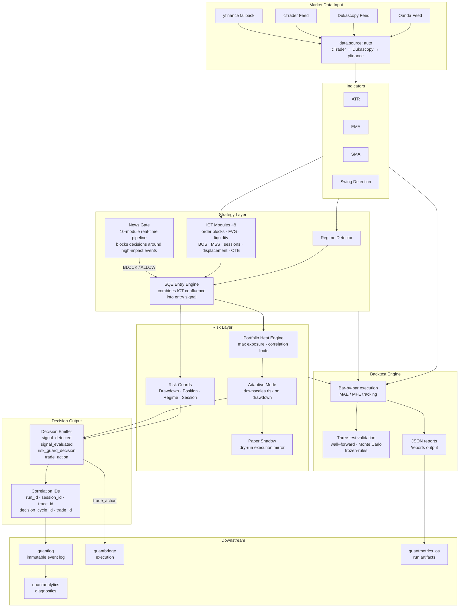

# quantbuild

Decision engine for the QuantMetrics Suite. Processes market data into typed trade decisions through a layered signal and risk stack. Delegates execution to `quantbridge` and event storage to `quantlog`.

Design boundary: `quantbuild` decides. `quantbridge` executes.

---

## Role in the suite

```
Market data  →  quantbuild  →  quantlog  →  quantanalytics
                     ↓
                quantbridge  (execution only)
```

`quantbuild` is the origin of all decision-chain correlation IDs consumed downstream by `quantbridge`, `quantlog`, `quantanalytics`, and `quantresearch`.

---

## Architecture



---

## Project structure

```
src/quantbuild/
├── models/            Pydantic v2 typed models (Trade, Signal, Config)
├── strategy_modules/  ICT modules (×8) + Regime Detector + News Gate
├── strategies/        SQE entry engine
├── backtest/          Bar-by-bar engine with MAE/MFE tracking
├── news/              Real-time pipeline (10 modules)
├── execution/         Adaptive Mode + Heat Engine + Paper Shadow
├── indicators/        ATR, EMA, SMA, Swing Detection
├── alerts/            Telegram notifications
├── dashboard/         Streamlit web UI
├── data/              Session logic, schemas
└── io/                Parquet loader, Oanda/Dukascopy/cTrader feeds
scripts/               analysis, validation, and ops helpers (38 Python scripts)
configs/               YAML configs + instrument profiles
tests/                 pytest suite (~216 tests, 29 test modules + conftest)
reports/               JSON output from backtests and validation
```

---

## Correlation IDs

`quantbuild` is the origin of all decision-chain correlation keys consumed downstream.

| ID | Emitted on | Consumed by |
|---|---|---|
| `run_id` | run start | `quantlog`, `quantanalytics`, `quantresearch` |
| `session_id` | session start | `quantlog`, `quantanalytics` |
| `trace_id` | each execution trace | `quantbridge`, `quantlog` |
| `decision_cycle_id` | `signal_detected` → `trade_action` chain | `quantanalytics` (funnel + guard attribution) |
| `trade_id` | trade lifecycle entry | `quantbridge`, `quantlog` |

Without these keys, downstream diagnostics run but decision attribution quality drops.

---

## Quick start

```bash
python -m venv .venv
.venv\Scripts\activate
pip install -r requirements.txt
cp .env.example .env
```

Run tests:

```bash
pytest tests/ -v
```

Dry-run via Oanda:

```bash
python -m src.quantbuild.app --config configs/strict_prod_v2.yaml live --dry-run
```

Dry-run via cTrader (requires `quantbridge`):

```bash
python -m src.quantbuild.app --config configs/demo_strict_ctrader.yaml live --dry-run
```

Set `QUANTBRIDGE_SRC_PATH` in `.env` when running with cTrader. See `docs/CREDENTIALS_AND_ENVIRONMENT.md` for full environment setup.

---

## Testing

About **216** pytest tests across **29** test modules (`tests/test_*.py`, plus `conftest.py`), covering the backtest engine, ICT modules, indicators, live runner, models, news pipeline, portfolio heat engine, adaptive mode, QuantLog contracts, and suite layout checks.

```bash
pytest tests/ -v
```

Three-test validation protocol (walk-forward, Monte Carlo, frozen-rules) documented in `scripts/validation_protocol.py`.

Run as part of the root suite before opening a PR. CI validates the full cross-module baseline on every push.

---

## Suite path policy

Production layout expects one canonical suite root with sibling repos: `quantbuild`, `quantbridge`, `quantlog`, `quantanalytics`, `quantmetrics_os`.

Environment variables used:

| Variable | Purpose |
|---|---|
| `QUANTMETRICS_OS_ROOT` | Suite root path |
| `QUANTLOG_REPO_PATH` | Log artifact output |
| `QUANTBRIDGE_SRC_PATH` | cTrader execution bridge |
| `QUANTMETRICS_ANALYTICS_OUTPUT_DIR` | Analytics report target |

Verify layout:

```bash
python scripts/check_suite_layout.py
```

---

## Notes

- `data.source: auto` tries cTrader → Dukascopy → yfinance in order.
- `quantlog.auto_analytics: true` auto-runs `quantanalytics` after a finished backtest.
- `artifacts.enabled: true` copies post-backtest artifacts to `quantmetrics_os/runs/`.

---

## Documentation

- [`docs/CREDENTIALS_AND_ENVIRONMENT.md`](docs/CREDENTIALS_AND_ENVIRONMENT.md)
- [`scripts/validation_protocol.py`](scripts/validation_protocol.py)
- [`../quantmetrics_os/docs/RUN_ARTIFACT_STRATEGY.md`](../quantmetrics_os/docs/RUN_ARTIFACT_STRATEGY.md)

---

## Suite repositories

| Module | Repository |
|---|---|
| `quantmetrics_os` | [roelofgootjesgit/quantmetrics_os](https://github.com/roelofgootjesgit/quantmetrics_os) |
| `quantbuild` (**this**) | [roelofgootjesgit/QuantBuild-Signal-Engine](https://github.com/roelofgootjesgit/QuantBuild-Signal-Engine) |
| `quantbridge` | canonical module: `quantbridge` |
| `quantlog` | canonical module: `quantlog` |
| `quantanalytics` | canonical module: `quantanalytics` |
