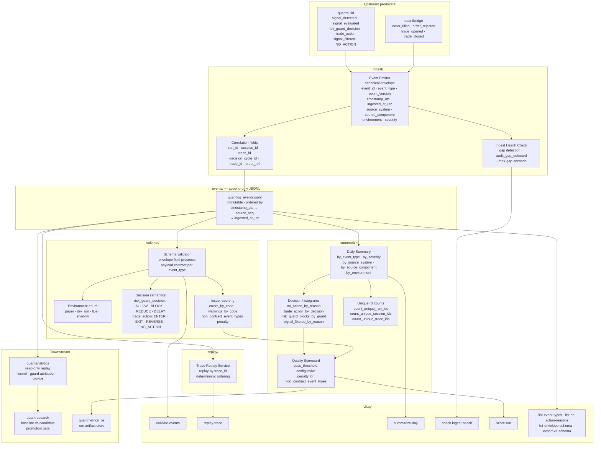

# quantlog

Event backbone for the QuantMetrics Suite. Append-only JSONL event store with schema validation, deterministic trace replay, ingest health monitoring, and quality scoring. The canonical correlation layer across all modules.

This is an event spine, not a BI platform.

---

## Role in the suite

```
quantbuild / quantbridge  →  quantlog  →  quantanalytics  →  quantresearch / promotion gates
```

`quantlog` enforces and preserves correlation identifiers emitted by upstream producers. Because these fields are validated in one place, downstream modules can do deterministic replay, analytics, and promotion checks without bespoke glue logic.

---

## Architecture



---

## Core contracts

**Required envelope fields** — present on every event:

`event_id` · `event_type` · `event_version` · `timestamp_utc` · `ingested_at_utc` · `source_system` · `source_component` · `environment` · `run_id` · `session_id` · `source_seq` · `trace_id` · `severity` · `payload`

**Environment enum:** `paper` · `dry_run` · `live` · `shadow`

**Decision semantics:**

| Field | Allowed values |
|---|---|
| `risk_guard_decision.decision` | `ALLOW` · `BLOCK` · `REDUCE` · `DELAY` |
| `trade_action.decision` | `ENTER` · `EXIT` · `REVERSE` · `NO_ACTION` |

**Replay ordering:** `timestamp_utc` → `source_seq` → `ingested_at_utc`

---

## Correlation contract

`quantlog` is the canonical correlation layer. It enforces identifiers emitted by upstream producers so downstream modules get deterministic replay and attribution without bespoke glue logic.

| Key | Scope |
|---|---|
| `run_id` | One run artifact set |
| `session_id` | Related runtime sessions inside a run |
| `trace_id` | End-to-end execution traces |
| `decision_cycle_id` | Decision-chain integrity (`signal_detected` → `trade_action`) |
| `trade_id` / `order_ref` | Execution and lifecycle linkage |

---

## Repository layout

```
quantlog/
├── src/quantlog/
│   ├── events/       schema + io
│   ├── ingest/       emitters + health checks
│   ├── validate/     contract validator
│   ├── replay/       trace replay service
│   ├── summarize/    daily summary service
│   └── cli.py
├── scripts/          smoke + synthetic data + ci runner
├── tests/            unit tests
├── data/events/      sample/generated event files
├── configs/          schema registry
└── docs/             full documentation index at docs/README.md
```

---

## Quick start

```powershell
cd quantlog
python -m venv .venv
.venv\Scripts\activate
python -m pip install -e .
```

---

## CLI reference

| Command | Purpose |
|---|---|
| `validate-events --path <dir>` | Schema and contract validation, returns `errors_by_code` and `warnings_by_code` |
| `replay-trace --path <dir> --trace-id <id>` | Deterministic replay of one trace |
| `summarize-day --path <dir>` | Daily summary with decision histograms and unique ID counts |
| `check-ingest-health --path <dir> --max-gap-seconds <n>` | Gap detection, optional `--emit-audit-gap` |
| `score-run --path <dir> --pass-threshold <n>` | Quality scorecard, includes throughput histograms |
| `list-event-types` | v1 contract event types and required payload keys |
| `list-no-action-reasons` | Canonical `NO_ACTION` payload reasons for `quantbuild` emitters |
| `list-envelope-schema` | Required envelope fields, allowed enums and decision values |
| `export-v1-schema` | Full v1 schema as JSON for docs/codegen |

Nightly chain (validate → replay → summarize → score, exit code reflects worst failure):

```powershell
powershell -File scripts/nightly_quantlog_report.ps1 -Path data/events/sample
```

```bash
bash scripts/nightly_quantlog_report.sh data/events/sample   # Linux/VPS
```

---

## Testing and synthetic data

Unit tests:

```powershell
python -m unittest discover -s tests -p "test_*.py" -v
```

End-to-end smoke:

```powershell
python scripts/smoke_end_to_end.py
```

Generate a synthetic sample day:

```powershell
python scripts/generate_sample_day.py \
  --output-path data/events/generated \
  --date 2026-03-29 \
  --traces 25
```

Generate with anomalies for negative quality tests:

```powershell
python scripts/generate_sample_day.py \
  --output-path data/events/generated \
  --date 2026-03-29 --traces 25 --inject-anomalies

python -m quantlog.cli score-run \
  --path data/events/generated/2026-03-29 \
  --pass-threshold 95
```

Contract integration check:

```powershell
python scripts/contract_check.py --contracts-path tests/fixtures/contracts --max-warnings 0
```

Local CI gates:

```powershell
.\scripts\ci_smoke.ps1
```

---

## Documentation

All docs live under `docs/`. Start at [`docs/README.md`](docs/README.md) for the full index.

| Document | Purpose |
|---|---|
| [`docs/EVENT_SCHEMA.md`](docs/EVENT_SCHEMA.md) | Canonical schema and payload definitions |
| [`docs/QUANTLOG_V1_ARCHITECTURE.md`](docs/QUANTLOG_V1_ARCHITECTURE.md) | Architecture and MVP boundaries |
| [`docs/EVENT_VERSIONING_POLICY.md`](docs/EVENT_VERSIONING_POLICY.md) | Schema/version compatibility policy |
| [`docs/QUANTLOG_GUARDRAILS.md`](docs/QUANTLOG_GUARDRAILS.md) | Scope boundaries and non-negotiables |
| [`docs/SCHEMA_CHANGE_CHECKLIST.md`](docs/SCHEMA_CHANGE_CHECKLIST.md) | Checklist for schema changes |
| [`docs/REPLAY_RUNBOOK.md`](docs/REPLAY_RUNBOOK.md) | Incident/replay/ops procedures |
| [`docs/QUANTBUILD_QUANTLOG_INTEGRATION_PLAN.md`](docs/QUANTBUILD_QUANTLOG_INTEGRATION_PLAN.md) | Integration plan dry-run → full stack |
| [`docs/QUANT_STACK_INTEGRATION_ACCEPTANCE.md`](docs/QUANT_STACK_INTEGRATION_ACCEPTANCE.md) | Stack acceptance dossier |
| [`docs/VPS_SYNC.md`](docs/VPS_SYNC.md) | VPS sync workflow |
| [`docs/ROADMAP_EXECUTION_STATUS.md`](docs/ROADMAP_EXECUTION_STATUS.md) | Roadmap and completion log |

---

## Suite repositories

| Module | Repository |
|---|---|
| `quantmetrics_os` | [roelofgootjesgit/quantmetrics_os](https://github.com/roelofgootjesgit/quantmetrics_os) |
| `quantbuild` | [roelofgootjesgit/QuantBuild-Signal-Engine](https://github.com/roelofgootjesgit/QuantBuild-Signal-Engine) |
| `quantbridge` | canonical module: `quantbridge` |
| `quantlog` (**this**) | canonical module: `quantlog` |
| `quantanalytics` | canonical module: `quantanalytics` |
| `quantresearch` | canonical module: `quantresearch` |
