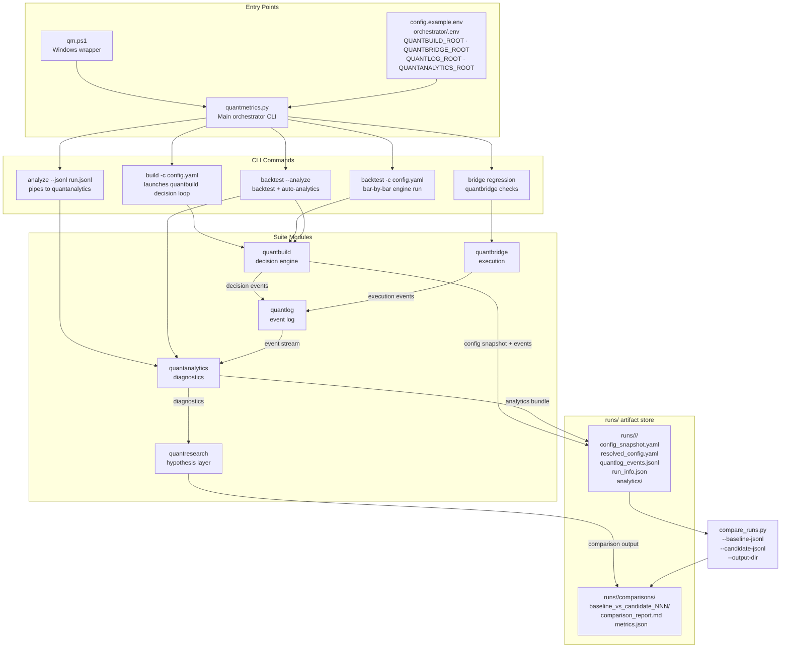

# quantmetrics_os

Orchestration layer for the QuantMetrics Suite. One entry point to resolve paths, environment, and subprocess commands for all suite modules. Collects reproducible run artifacts and enables baseline-vs-candidate comparison across runs.

---

## Role in the suite

```
quantmetrics_os  →  quantbuild  →  quantbridge  →  quantlog  →  quantanalytics  →  quantresearch
      ↑                                                                                    |
      └──────────────────────── run artifacts / comparison outputs ───────────────────────┘
```

`quantmetrics_os` is the orchestration and artifact correlation hub. It binds one run context to concrete artifact paths, keeps config snapshots aligned with produced event logs and analytics outputs, and enables reproducible baseline-vs-candidate comparisons.

---

## Architecture


```mermaid
flowchart TD

    %% ── ENTRY ───────────────────────────────────────────────
    subgraph ENTRY["Entry Points"]
        CLI["quantmetrics.py\nMain orchestrator CLI"]
        PS["qm.ps1\nWindows wrapper"]
        ENV["config.example.env\norchestrator/.env\nQUANTBUILD_ROOT · QUANTBRIDGE_ROOT\nQUANTLOG_ROOT · QUANTANALYTICS_ROOT"]
    end

    PS --> CLI
    ENV --> CLI

    %% ── COMMANDS ─────────────────────────────────────────────
    subgraph CMD["CLI Commands"]
        BUILD["build -c config.yaml\nlaunches quantbuild decision loop"]
        BACKTEST["backtest -c config.yaml\nbar-by-bar engine run"]
        ANALYZE["analyze --jsonl run.jsonl\npipes to quantanalytics"]
        BRIDGE["bridge regression\nquantbridge checks"]
        BACKTEST_A["backtest --analyze\nbacktest + auto-analytics"]
    end

    CLI --> BUILD
    CLI --> BACKTEST
    CLI --> ANALYZE
    CLI --> BRIDGE
    CLI --> BACKTEST_A

    %% ── MODULES ──────────────────────────────────────────────
    subgraph MODULES["Suite Modules"]
        QB["quantbuild\ndecision engine"]
        QBR["quantbridge\nexecution"]
        QL["quantlog\nevent log"]
        QA["quantanalytics\ndiagnostics"]
        QR["quantresearch\nhypothesis layer"]
    end

    BUILD      --> QB
    BACKTEST   --> QB
    BRIDGE     --> QBR
    ANALYZE    --> QA
    BACKTEST_A --> QB
    BACKTEST_A --> QA

    QB  -->|decision events| QL
    QBR -->|execution events| QL
    QL  -->|event stream| QA
    QA  -->|diagnostics| QR

    %% ── ARTIFACT STORE ───────────────────────────────────────
    subgraph RUNS["runs/ artifact store"]
        RUN["runs/<experiment>/<role>/\nconfig_snapshot.yaml\nresolved_config.yaml\nquantlog_events.jsonl\nrun_info.json\nanalytics/"]
        COMP["runs/<experiment>/comparisons/\nbaseline_vs_candidate_NNN/\n  comparison_report.md\n  metrics.json"]
    end

    QB  -->|config snapshot + events| RUN
    QA  -->|analytics bundle| RUN
    QR  -->|comparison output| COMP

    %% ── COMPARE SCRIPT ───────────────────────────────────────
    COMPARE["compare_runs.py\n--baseline-jsonl\n--candidate-jsonl\n--output-dir"]
    RUN --> COMPARE
    COMPARE --> COMP
```

---

## Repository layout

| Path | Purpose |
|---|---|
| `orchestrator/quantmetrics.py` | Main orchestrator CLI and subprocess launcher |
| `orchestrator/qm.ps1` | Windows wrapper for orchestrator commands |
| `orchestrator/config.example.env` | Baseline environment template for suite paths |
| `orchestrator/config.vps.example.env` | VPS/Linux path and environment template |
| `scripts/clone_quant_suite.sh` | Clone/update helper for suite repos |
| `scripts/compare_runs.py` | Baseline-vs-candidate comparison script |
| `vscode/quant-suite.code-workspace` | Multi-root workspace for suite development |
| `docs/` | Handouts, roadmap, and implementation documentation |
| `runs/` | Collected experiment artifacts and analytics bundles |

---

## Run artifact convention

Every run produces a consistent artifact set under `runs/<experiment>/<role>/`:

```
runs/<experiment>/
  <role>/
    config_snapshot.yaml     — input --config file copy
    resolved_config.yaml     — merged effective config (secrets redacted)
    quantlog_events.jsonl    — immutable event log for this run
    run_info.json            — run metadata
    analytics/               — quantanalytics output bundle
  comparisons/
    baseline_vs_candidate_NNN/
      comparison_report.md
      metrics.json
```

---

## Quick start

Expected folder layout:

```
<parent>/
  quantmetrics_os/
  quantbuild/
  quantbridge/
  quantlog/
  quantanalytics/
  quantresearch/
```

1. Copy `orchestrator/config.example.env` to `orchestrator/.env`
2. Set `QUANTBUILD_ROOT`, `QUANTBRIDGE_ROOT`, `QUANTLOG_ROOT`, `QUANTANALYTICS_ROOT`
3. Run from `orchestrator/`:

```powershell
python quantmetrics.py build -c configs/strict_prod_v2.yaml
```

---

## CLI reference

```powershell
# Decision loop
python quantmetrics.py build -c configs/strict_prod_v2.yaml

# Backtest only
python quantmetrics.py backtest -c configs/foo.yaml

# Backtest + auto-analytics
python quantmetrics.py backtest -c configs/foo.yaml --analyze

# Run analytics on an existing log
python quantmetrics.py analyze --jsonl path/to/run.jsonl

# Bridge regression checks
python quantmetrics.py bridge regression
```

---

## Cross-run comparison

```powershell
python scripts/compare_runs.py `
  --baseline-jsonl runs/<experiment>/baseline/quantlog_events.jsonl `
  --candidate-jsonl runs/<experiment>/candidate/quantlog_events.jsonl `
  --output-dir runs/<experiment>/comparisons/baseline_vs_candidate_001
```

Produces `comparison_report.md` and `metrics.json` in the output directory. Used by `quantresearch` as input for the promotion gate.

---

## Documentation

- [`docs/SUITE_START_HANDOUT.md`](docs/SUITE_START_HANDOUT.md)
- [`docs/RUN_ARTIFACT_STRATEGY.md`](docs/RUN_ARTIFACT_STRATEGY.md)
- [`docs/SHOWCASE.md`](docs/SHOWCASE.md)
- [`docs/QUANTMETRICS_SPRINT_PLAN.md`](docs/QUANTMETRICS_SPRINT_PLAN.md)
- [`docs/Roadmap_os.md`](docs/Roadmap_os.md)

---

## Suite repositories

| Module | Repository |
|---|---|
| `quantmetrics_os` (**this**) | [roelofgootjesgit/quantmetrics_os](https://github.com/roelofgootjesgit/quantmetrics_os) |
| `quantbuild` | [roelofgootjesgit/QuantBuild-Signal-Engine](https://github.com/roelofgootjesgit/QuantBuild-Signal-Engine) |
| `quantbridge` | canonical module: `quantbridge` |
| `quantlog` | canonical module: `quantlog` |
| `quantanalytics` | canonical module: `quantanalytics` |
| `quantresearch` | canonical module: `quantresearch` |
