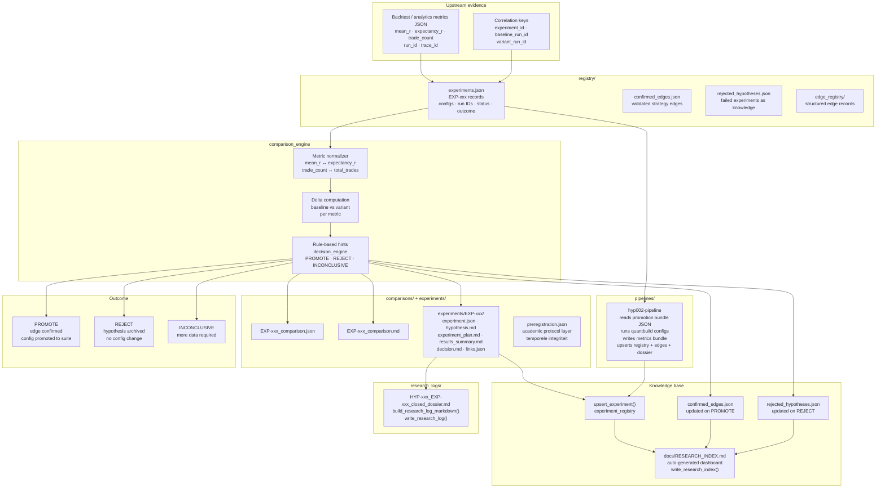

# quantresearch

Research and decision layer for the QuantMetrics Suite. Captures hypothesis-driven strategy research: what was tested, what was learned, and what changes next. Converts correlated evidence from upstream modules into explicit promotion or rejection decisions.

Not a loose notebook — a structured research machine with registry, comparison engine, and auditable knowledge files.

---

## Role in the suite

```
quantbuild / quantbridge  →  quantlog  →  quantanalytics  →  quantresearch  →  promotion / rejection
```

Upstream modules produce correlated evidence. `quantresearch` converts that evidence into governance decisions. One hypothesis per experiment, one controlled change per run, baseline required, conclusions traceable to numbers.

---

## Architecture



---

## Research loop

```
Hypothesis → build variant → backtest / run → metrics + analytics
    → compare to baseline → conclusion → PROMOTE / REJECT → update knowledge base
```

Design rules enforced structurally:

- One hypothesis per experiment
- Same data window for baseline and variant
- Baseline always required
- Run IDs tied to real artifacts
- Conclusions traceable to numbers

---

## Repository layout

```
quantresearch/         Python package (installable)
registry/
├── experiments.json          one record per study (EXP-xxx)
├── confirmed_edges.json      validated strategy edges
└── rejected_hypotheses.json  failed experiments as knowledge
schemas/               JSON Schema for experiments and research logs
research_logs/         human-readable strategy research log files
comparisons/           JSON + Markdown comparison artifacts
experiments/           per-experiment ledger (EXP-xxx/)
pipelines/             promotion bundle definitions
templates/             Markdown templates for logs and comparisons
tests/                 pytest
docs/                  workflow guide + auto-generated RESEARCH_INDEX.md
```

---

## Quick start

```bash
pip install -e ".[dev]"    # dev: pytest — Python 3.10+, no runtime dependencies
```

If importing from another working directory:

```bash
set QUANTRESEARCH_ROOT=C:\path\to\quantresearch    # Windows
export QUANTRESEARCH_ROOT=/path/to/quantresearch   # Unix
```

---

## Usage

**Compare two runs:**

```python
from pathlib import Path
from quantresearch.comparison_engine import (
    compare_runs,
    write_comparison_artifacts,
    load_json_metrics,
)

baseline = load_json_metrics(Path("artifacts/baseline_metrics.json"))
variant  = load_json_metrics(Path("artifacts/variant_metrics.json"))

cmp = compare_runs(
    baseline,
    variant,
    experiment_id="EXP-001",
    baseline_run_id="20260422_192631Z",
    variant_run_id="20260422_192633Z",
)
write_comparison_artifacts(cmp)
```

**Update experiment registry:**

```python
from quantresearch.experiment_registry import upsert_experiment
upsert_experiment(...)
```

**Refresh the research index:**

```python
from quantresearch.markdown_renderer import write_research_index
write_research_index()
```

**Run a pipeline (example: HYP-002):**

```bash
cd quantresearch
python -m quantresearch hyp002-pipeline
python -m quantresearch hyp002-pipeline --dry-run       # dry run
python -m quantresearch hyp002-pipeline --no-registry   # metrics only
```

Reads `pipelines/hyp002_promotion_bundle.json`, runs each listed `quantbuild` config, writes `runs/<bundle_id>/metrics_bundle.json`, upserts `experiments.json`, updates `confirmed_edges.json`, and closes the experiment dossier under `experiments/EXP-002/`.

**Validate an experiment ledger:**

```bash
python -m quantresearch validate --experiment-id EXP-002
```

---

## Testing

```bash
py -3 -m pytest -q
```

Run as part of the root suite before opening a PR. CI validates the full cross-module baseline on every push.

---

## Documentation

| Document | Purpose |
|---|---|
| [`docs/RESEARCH_INDEX.md`](docs/RESEARCH_INDEX.md) | Auto-generated snapshot of experiments, edges, and rejected hypotheses |
| [`docs/WORKFLOW_BACKTEST_NAAR_STRATEGIE.md`](docs/WORKFLOW_BACKTEST_NAAR_STRATEGIE.md) | End-to-end workflow from backtest to strategy decision |
| [`docs/ACADEMIC_RESEARCH_PROTOCOL.md`](docs/ACADEMIC_RESEARCH_PROTOCOL.md) | Governance vs inference protocol, pre-registration policy |

---

## Suite repositories

| Module | Repository |
|---|---|
| `quantmetrics_os` | [roelofgootjesgit/quantmetrics_os](https://github.com/roelofgootjesgit/quantmetrics_os) |
| `quantbuild` | [roelofgootjesgit/QuantBuild-Signal-Engine](https://github.com/roelofgootjesgit/QuantBuild-Signal-Engine) |
| `quantbridge` | canonical module: `quantbridge` |
| `quantlog` | canonical module: `quantlog` |
| `quantanalytics` | canonical module: `quantanalytics` |
| `quantresearch` (**this**) | [roelofgootjesgit/QuantResearch-Decision-Engine](https://github.com/roelofgootjesgit/QuantResearch-Decision-Engine) |
